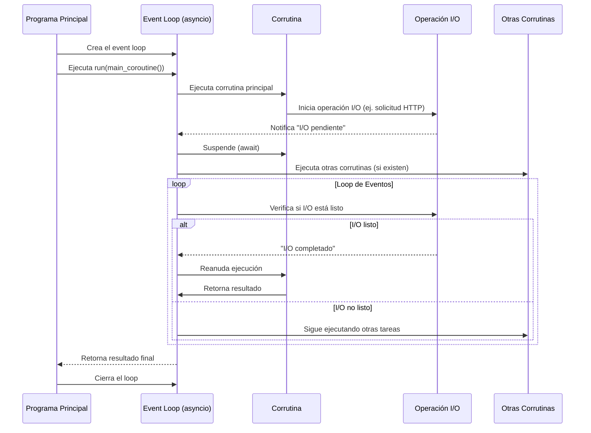

# **¿Qué es asyncio?**

`asyncio` es un módulo de Python que proporciona soporte para la programación concurrente, `asyncio` := `Asynchronous Input Output`, el cual permite ejecutar múltiples tareas concurrentemente sin necesidad de usar hilos (`threads`) o procesos múltiples.

En una aplicación síncrona, el código se ejecuta secuencialmente. La siguiente línea de código se ejecuta en cuanto termina la anterior, y solo ocurre una cosa a la vez. Sin embargo, ¿qué pasa si una línea de código es especialmente lenta? En ese caso, todo el código posterior a nuestra línea lenta se bloqueará esperando a que se complete, dejándonos con un spinner o una interfaz de usuario que no responde.

Para solucionar este tipo de problemas nace la programación concurrente (Asincrona). Donde se más de una tarea es manejada al mismo tiempo (Multi-tarea).


## Framework Asyncio

`asyncio` es un **framework de programación asíncrona** basado en la ejecución de un **loop de eventos**. Este facilita la ejecución de **código no bloqueante**, lo que significa que una tarea puede avanzar mientras espera que otras terminen.

En Python 3.4, se introdujo `asyncio` por primera vez con decoradores junto con el generador `yield` para definir **corrutinas**. Una **corrutina** es un método que puede pausarse cuando tenemos una tarea que podría tardar mucho en ejecutarse y reanudarse al finalizar dicha tarea. En Python 3.5, el lenguaje implementó soporte para corrutinas y programación asíncrona con las palabras clave `async` y `await`.

`asyncio` utiliza un modelo de concurrencia conocido como **single-threaded event loop** que se traduce como loop de eventos en un único hilo.

`asyncio` se puede utilizar tanto para uso intensivo de I/O o de CPU!!!

Podemos clasifica el código de una aplicación en estas dos categorias:

- I/O bound: Operaciones que pasan más tiempo esperando una llamada de red o periferico.
- CPU bound: Operaciones que pasan más tiempo usando CPU.

Por ejemplo:

```python title="Código desglosado" linenums="1"
import requests

response = request.get('https://www.google.com.mx')    # I/O - bound
items = response.headers.items()                       # CPU - bound
headers = [f'{key}:{value}' for key, value in items]   # CPU - bound
str_headers = "\n".join(headers)                       # CPU - bound
with open('headers_dump.txt', 'w') as ptr_file:        # I/O - bound
    ptr_file.write(str_headers)                        # I/O - bound
```

El código asincrono nos permite pausar la ejecución de algun metodo que tiene una operación I/O, para
permitir ejecutar otras tareas mientras que el metodo "pausado" ejecuta la operación I/O en background.

La diferencia de concurrencia a paralelismo, es que, en concurrencia tenemos varias tareas ocurriendo al mismo tiempo, pero solo una se está ejecutando activamente en un momento dado. Con el paralelismo, tenemos varias tareas ocurriendo y estamos ejecutando activamente más de una simultáneamente.

`asyncio` provee un conjunto de APIs de alto nivel para:

- ejecutar corutinas de Python de manera concurrente y tener control total sobre su ejecución;
- realizar tareas de Entrada/Salida (I/O) y comunicación entre procesos(IPC);
- controlar subprocesos;
- distribuir tareas a través de colas;
- sincronizar código concurrente;

Este módulo es útil para manejar múltiples tareas de I/O (entrada/salida), como:

- Llamadas a APIs.
- Acceso a bases de datos.
- Lectura y escritura de archivos.
- Servidores web o clientes que manejan muchas conexiones simultáneamente.


## Pasos de Ejecución de una Corrutina en Asyncio

- **Inicio**: El programa principal crea y ejecuta el event loop.
- **Ejecución inicial**: El event loop comienza ejecutando la corrutina principal.
- **Operación I/O**: Cuando la corrutina encuentra una operación I/O (ej. await requests.get()), la inicia y se suspende (await).
- **Gestión del loop**: 
    - **Monitorea I/O (Alt)**: Verifica si las operaciones pendientes están completadas.
    - **Ejecuta otras tareas (else)**: Mientras espera, ejecuta otras corrutinas listas.
- **Reanudación**: Cuando el I/O se completa, el loop reanuda la corrutina suspendida.
- **Finalización**: El loop retorna el resultado al programa principal y se cierra.




### Características clave del Event Loop:

- **Single-threaded**: Maneja múltiples operaciones concurrentes en un solo hilo.
- **Cooperativo**: Las corrutinas deben ceder el control explícitamente (await).
- **Eficiente**: Evita bloqueos usando I/O no bloqueante y callbacks.


### Multitareas

#### Multitarea Preventiva

En este modelo, dejamos que el sistema operativo decida cómo alternar entre las tareas que se están ejecutando mediante un proceso denominado "fragmentación de tiempo". Cuando el sistema operativo alterna entre tareas, se le llama "preempting".

El funcionamiento interno de este mecanismo depende del sistema operativo. Se logra principalmente mediante el uso de múltiples hilos o procesos.

#### Multitarea Cooperativa

En este modelo, en lugar de depender del sistema operativo para decidir cuándo alternar entre las tareas que se están ejecutando, se codifica explícitamente puntos en la aplicación donde se permite que se ejecuten otras tareas. Las tareas de la aplicación operan en un modelo donde cooperan, indicando explícitamente: "Estoy pausando mi tarea por un momento; continúe y ejecute otras tareas".


## **Beneficios de asyncio**

### **Eficiencia y Concurrencia**:

- `asyncio` permite manejar miles de conexiones sin necesidad de múltiples hilos o procesos.
- Evita bloqueos al usar operaciones de I/O asíncronas.

### **Menor Consumo de Recursos**

- A diferencia de los hilos (`threads`), `asyncio` no requiere cambiar el contexto de ejecución, lo que ahorra memoria y CPU. Cuando un sistema operativo necesita cambiar entre la ejecución de un hilo o un proceso, implica un cambio de contexto. Los cambios de contexto son operaciones intensivas porque el sistema operativo debe guardar información sobre el proceso o hilo en ejecución para poder recargarlo.

### **Código más Sencillo y Legible**

- En comparación con `threading` o `multiprocessing`, `asyncio` permite escribir código secuencial que sigue una lógica más natural.

### **Ideal para Aplicaciones de Red debido a su granularidad**

- Servidores web como **FastAPI** o bibliotecas como **aiohttp** dependen de `asyncio` para manejar muchas solicitudes concurrentes sin bloquear el programa.
- Un sistema operativo sabe que un hilo o una tarea debe pausarse según el algoritmo de programación que utilice, pero ese podría no ser el mejor momento para hacerlo. Con la multitarea cooperativa, marcamos explícitamente las áreas que son las mejores para pausar nuestras tareas. Esto nos proporciona cierta eficiencia, ya que solo cambiamos de tarea cuando sabemos explícitamente que es el momento adecuado. 


## Concurrencia vs Paralelismo

Si bien el paralelismo implica concurrencia, la concurrencia no siempre implica paralelismo.
Una aplicación multi-hilo que se ejecuta en una máquina multinúcleo es concurrente y paralela. 

En esta configuración, tenemos varias tareas ejecutándose simultáneamente y dos núcleos ejecutando independientemente el código asociado a ellas.

Sin embargo, con la multitarea (Multitasking), podemos tener varias tareas ocurriendo simultáneamente, pero solo una de ellas se está ejecutando en un momento dado.


