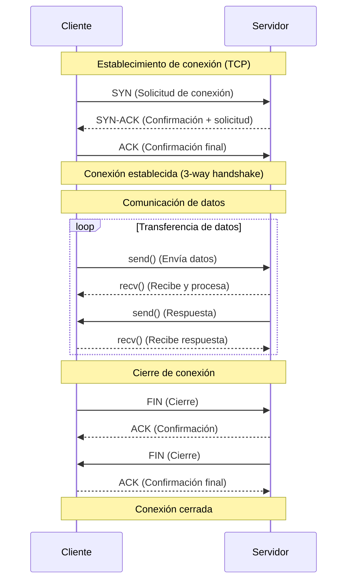

# Procesos e Hilos

## Hilos

Los **hilos** pueden considerarse **procesos** más ligeros. Además, son la construcción más pequeña que puede gestionar un sistema operativo. No tienen memoria propia como un proceso; comparten la memoria del proceso que los creó. Los hilos están asociados al proceso que los creó. Un proceso siempre tendrá al menos un hilo asociado, generalmente conocido como **hilo principal**. Un proceso también puede crear otros hilos, más comúnmente conocidos como hilos de trabajo o en segundo plano. Estos hilos pueden realizar otras tareas simultáneamente junto con el hilo principal. Los hilos, al igual que los procesos, pueden ejecutarse simultáneamente en una CPU multinúcleo, y el sistema operativo también puede alternar entre ellos mediante la segmentación de tiempo.

Cuando ejecutamos una aplicación Python normal, creamos un proceso y un hilo principal que se encargará de ejecutar nuestra aplicación Python.


```python title="Detalles del Hilo" linenums="1"
import os
import threading

def print_thread_details():
    print(f'Este proceso de Python corren con el id: {os.getpid()}')
    total_threads = threading.active_count()
    thread_name = threading.current_thread().name
    print(f'Python esta corriendo {total_threads} hilos')
    print(f'El hilo actual es {thread_name}')

if __name__ == '__main__':
    print_thread_details()
```

```python title="Salida"
Este proceso de Python corren con el id: 84736
Python esta corriendo 1 hilos
El hilo actual es MainThread
```

Cada vez que lo ejecutamos se actualiza el `id` de hilo corriendo el programa.


```python title="Multi-Hilos" linenums="1"
import threading


def hello_from_thread():
    print(f'Hola desde el hilo {threading.current_thread()}!')

def test_threading():
    hello_thread = threading.Thread(target=hello_from_thread)
    hello_thread.start()
    total_threads = threading.active_count()
    thread_name = threading.current_thread().name
    print(f'Python esta corriendo {total_threads} hilo(s)')
    print(f'Hilo actual {thread_name}')
    hello_thread.join()


if __name__ == '__main__':
    test_threading()
```

```python title="Salida de multiples ejecuciones"
root@adafb481d2b7:/app# /usr/local/bin/python /app/src/capitulo_01/section_01/multithread.py
Hola desde el hilo <Thread(Thread-1 (hello_from_thread), started 131578161936064)>!
Python esta corriendo 2 hilo(s)
Hilo actual MainThread
root@adafb481d2b7:/app# /usr/local/bin/python /app/src/capitulo_01/section_01/multithread.py
Hola desde el hilo <Thread(Thread-1 (hello_from_thread), started 134282509616832)>!
Python esta corriendo 2 hilo(s)
Hilo actual MainThread
root@adafb481d2b7:/app# /usr/local/bin/python /app/src/capitulo_01/section_01/multithread.py
Hola desde el hilo <Thread(Thread-1 (hello_from_thread), started 130133606295232)>!
Python esta corriendo 2 hilo(s)
Hilo actual MainThread
root@adafb481d2b7:/app# /usr/local/bin/python /app/src/capitulo_01/section_01/multithread.py
Hola desde el hilo <Thread(Thread-1 (hello_from_thread), started 135540787914432)>!
Python esta corriendo 2 hilo(s)
Hilo actual MainThread
```

Creamos un método para imprimir el nombre del hilo actual y luego creamos un hilo para ejecutar ese método. Después, llamamos al método de inicio del hilo para iniciar su ejecución. Finalmente, llamamos al método de unión (`join`). Esta acción pausará el programa hasta que el hilo que iniciamos se complete.


## Procesos

Un **proceso** es una aplicación que se ejecuta y tiene un espacio de memoria al que otras aplicaciones no pueden acceder. 

Varios procesos pueden ejecutarse en una sola máquina. Si usamos una máquina con una CPU de varios núcleos, podemos ejecutar varios procesos simultáneamente. Si usamos una CPU de un solo núcleo, podemos tener varias aplicaciones ejecutándose simultáneamente mediante la segmentación de tiempo. Cuando un sistema operativo utiliza la segmentación de tiempo, cambia automáticamente entre los procesos en ejecución después de un tiempo.

Los algoritmos que determinan cuándo se produce este cambio varían según el sistema operativo.


El multihilo no es la única forma de lograr concurrencia; también podemos crear múltiples procesos que realicen tareas simultáneamente. Esto se conoce como multiprocesamiento. En el multiprocesamiento, un proceso padre crea uno o más procesos hijos que gestiona. A continuación, se distribuye el trabajo entre los procesos hijos. 

Python nos proporciona el módulo multiprocesamiento para gestionar esto. La API es similar a la del módulo de subprocesos. Primero creamos un proceso con una función objetivo. Luego, llamamos a su método de inicio para ejecutarlo y, finalmente, a su método de unión para esperar a que finalice su ejecución.


```python title="Multi-procesos" linenums="1"
import multiprocessing
import os


def hello_from_process():
    print(f'Hola desde el proceso hijo {os.getpid()}')

def test_multiprocess():
    hello_process = multiprocessing.Process(target=hello_from_process)
    hello_process.start()
    print(f'Hola desde el proceso padre {os.getpid()}')
    hello_process.join()

if __name__ == '__main__':
    test_multiprocess()
```

```python title="Salida"
Hola desde el proceso padre 111502
Hola desde el proceso hijo 111503
```


## El GIL para CPU-Bound y I/O-Bound

El multiprocesamiento puede ejecutar múltiples instrucciones de bytecode simultáneamente porque cada proceso de Python tiene su propio GIL. Mientras que multithreading compartira el mismo GIL.

El bloqueo global del intérprete se libera cuando se realizan operaciones de E/S. Esto nos permite emplear subprocesos para realizar trabajo concurrente en lo que respecta a la E/S, pero no para el código Python dependiente de la CPU.


```python title="Sincrono vs Asincrono"
import time
import threading
import requests


def read_example() -> None:
    response = requests.get('https://www.google.com.mx')
    print(response.status_code)

def test_synchronous():
    sync_start = time.time()
    read_example()
    read_example()
    sync_end = time.time()
    print(f'Sincrono tomo {sync_end - sync_start:.4f} segundos.')

def test_asynchronous():
    thread_1 = threading.Thread(target=read_example)
    thread_2 = threading.Thread(target=read_example)
    thread_start = time.time()
    thread_1.start()
    thread_2.start()
    thread_1.join()
    thread_2.join()
    thread_end = time.time()
    print(f'Asincrono tomo {thread_end - thread_start:.4f} Segundos.')


if __name__ == '__main__':
    test_synchronous()
    test_asynchronous()
```

```bash title="Salida"
200
200
Sincrono tomo 0.4061 segundos.
200
200
Asincrono tomo 0.2086 Segundos.
```


Asyncio aprovecha que las operaciones de I/O liberan el GIL, lo caul habilita la concurrencia, incluso con un solo hilo. Al usar Asyncio, creamos objetos llamados corrutinas.


## Sockets como ejemplo

Un **socket** es una abstracción de bajo nivel para enviar y recibir datos a través de una red. Es la base de la transferencia de datos hacia y desde los servidores. Los sockets admiten dos operaciones principales: **enviar** y **recibir** bytes. Escribimos bytes en un socket, que luego se envían a una dirección remota, generalmente un servidor. Una vez enviados esos bytes, esperamos a que el servidor escriba su respuesta en nuestro socket. Una vez enviados estos bytes a nuestro socket, podemos leer el resultado.




### Ejemplo del Buzón de Correo

Los sockets son un concepto básico y bastante fáciles de entender si los consideramos como buzones. Podemos depositar una carta en nuestro buzón, que el cartero recoge y entrega en el buzón del destinatario. El destinatario abre su buzón y nuestra carta. Dependiendo del contenido, el destinatario podría respondernos.
En esta analogía, podemos pensar en la carta como los datos o bytes que queremos enviar.

Consideraremos que introducir una carta en el buzón equivale a escribir los bytes en un socket, y abrir el buzón para leerla equivale a leer los bytes de un socket. El cartero puede considerarse el mecanismo de transferencia a través de internet, que enruta los datos a la dirección correcta.

En el caso de obtener el contenido de www.google.com.mx, como vimos anteriormente, abrimos un socket que se conecta al servidor de www.google.com.mx. Luego, escribimos una solicitud para obtener el contenido en ese socket y esperamos a que el servidor responda con el resultado: en este caso, el HTML de la página web.

Los **sockets son blockeantes por defecto**. Esto significa que, cuando esperamos la respuesta de un servidor con datos, detenemos o bloqueamos nuestra aplicación hasta que obtengamos datos para leer. Por lo tanto, nuestra aplicación deja de ejecutar cualquier otra tarea hasta que recibamos datos del servidor, se produzca un error o se agote el tiempo de espera.

A nivel del sistema operativo, no necesitamos este bloqueo. Los **sockets pueden operar en modo NO bloqueante**. En este modo, cuando escribimos bytes en un socket, podemos simplemente ejecutar la escritura o lectura y olvidarnos de ella, mientras nuestra aplicación puede continuar realizando otras tareas. Posteriormente, podemos hacer que el sistema operativo nos informe de la recepción de bytes y los procese en ese momento. Esto permite que la aplicación realice diversas acciones mientras esperamos la devolución de los bytes. En lugar de bloquearnos y esperar a que lleguen los datos, nos volvemos más reactivos, permitiendo que el sistema operativo nos informe cuando hay datos sobre los que podemos actuar.

En segundo plano, esto lo realizan diferentes sistemas de notificación de eventos, según el sistema operativo que estemos ejecutando. Asyncio es lo suficientemente abstracto como para alternar entre los diferentes sistemas de notificación, según cuál sea compatible con nuestro sistema operativo.

Estos sistemas rastrean nuestros sockets no bloqueantes y nos notifican cuando están listos para que hagamos algo con ellos. Este sistema de notificación es la base de cómo asyncio logra la concurrencia. En el modelo de concurrencia de asyncio, solo tenemos un hilo ejecutando Python en un momento dado. Cuando realizamos una operación de I/O (Entrada/Salida), la transferimos al sistema de notificación de eventos de nuestro sistema operativo para que la registre. Una vez realizada esta transferencia, nuestro hilo de Python queda libre para seguir ejecutando otro código de Python o agregar más sockets no bloqueantes para que el sistema operativo los registre. Cuando nuestra operación de I/O finaliza, "despertamos" la tarea que esperaba el resultado y luego procedemos a ejecutar cualquier otro código de Python posterior a esa operación de I/O.


## Como funciona un Event Loop?

Un event loop (bucle de eventos) es la base de toda aplicación asyncio. Los bucles de eventos son un patrón de diseño bastante común en muchos sistemas y existen desde hace bastante tiempo. 


El bucle de eventos más básico es extremadamente simple. Creamos una cola que contiene una lista de eventos o mensajes. Luego, realizamos un bucle indefinido, procesando los mensajes uno a uno a medida que entran en la cola. En Python, un bucle de eventos básico podría verse así:

```python linenums="1"
from collections import deque

messages = deque()
while True:
    if messages:
        message = messages.pop()
        process_message(message)
```

En asyncio, el bucle de eventos mantiene una cola de tareas en lugar de mensajes. Las tareas son envoltorios de una corrutina. Una corrutina puede pausar la ejecución al alcanzar una operación de E/S y permite que el bucle de eventos ejecute otras tareas que no esperan la finalización de las operaciones de E/S.

Al crear un bucle de eventos, creamos una cola vacía de tareas. A continuación, podemos añadir tareas a la cola para su ejecución. Cada iteración del bucle de eventos comprueba las tareas que deben ejecutarse y las ejecuta una a una hasta que una tarea alcanza una operación de E/S. En ese momento, la tarea se pausa y le indicamos al sistema operativo que vigile los sockets para ver si se completa la E/S. A continuación, buscamos la siguiente tarea que se ejecutará. En cada iteración del bucle de eventos, comprobamos si alguna de nuestras E/S se ha completado; si es así, reactivamos las tareas pausadas y dejamos que finalicen su ejecución. 

Para ilustrar esto, imaginemos tres tareas que realizan una solicitud web asíncrona. Imaginemos que estas tareas tienen un fragmento de código de configuración, que está limitado por la CPU, luego realizan una solicitud web y, a continuación, un código de posprocesamiento limitado por la CPU. Ahora, enviemos estas tareas al bucle de eventos simultáneamente. En pseudocódigo, escribiríamos algo como esto:

```python
def make_request():
    cpu_bound_setup()
    io_bound_web_request()
    cpu_bound_postprocess()

task_one = make_request()
task_two = make_request()
task_three = make_request()
```

Al mandar llamar estas tres tareas de manera asyncrona.


1. Corre `task_one` su parte cpu_bound.
    - `task_two` espera iniciar
    - `task_three` espera iniciar
2. Al llegar a la parte io_bound de `task_one`
    - `task_one` espera terminación de I/O
    - `task_two` inicia su parte cpu_bound
    - `task_three` espera iniciar
3. Al llegar a la parte io_bound de `task_two`
    - `task_two` espera terminación de I/O
    - `task_one` revisa si ya termino su parte io_bound 
        - si termino, continue con el resto cpu_bound
        - si no, espera
    - `task_three` inicia su parte cpu_bound
4. Las tareas continuan hasta terminar.


