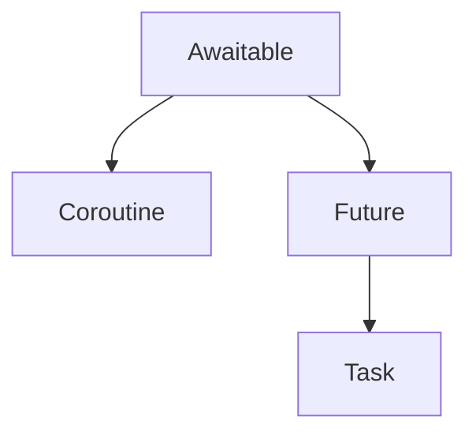

# Tasks, coroutines, futures y awaitables


## Futures


Un futuro es un objeto de Python que contiene un único valor que se espera obtener en algún momento en el futuro, pero que podría no tener aún. Normalmente, al crear un futuro, este no tiene ningún valor que lo envuelva porque aún no existe. En este estado, se considera incompleto, sin resolver o simplemente no terminado. Una vez obtenido un resultado, se puede establecer el valor del futuro. Esto completará el futuro; en ese momento, podemos considerarlo terminado y extraer el resultado del futuro. 


```python title="Ejemplo de futuro" linenums="1"
from asyncio import Future

my_future = Future()
print(f'my_future termino? {my_future.done()}')
my_future.set_result(42)
print(f'my_future termino? {my_future.done()}')
print(f'Cual es el resultado de my_future? {my_future.result()}')
```

```bash title="Salida"
  my_future = Future()
my_future termino? False
my_future termino? True
Cual es el resultado de my_future? 42
```


```python title="Ejemplo de futuro" linenums="1"
from asyncio import Future
import asyncio

def make_request() -> Future:
    future = Future()
    asyncio.create_task(set_future_value(future))
    return future

async def set_future_value(future) -> None:
    await asyncio.sleep(1)
    future.set_result(42)

async def main():
    future = make_request()
    print(f'Esta el futuro terminado? {future.done()}')
    value = await future
    print(f'Esta el futuro terminado? {future.done()}')
    print(value)

asyncio.run(main())
```

```bash title="Salida"
Esta el futuro terminado? False
Esta el futuro terminado? True
42
```

Notemos que la funcion `make_request` no es un awaitable pero si el futuro que es creado en dicha función! Ese futuro si es un awaitable!


Existe una fuerte relación entre las tareas y los futuros. Las tareas heredan directamente del futuro.
Un futuro puede considerarse como la representación de un valor que no tendremos durante un tiempo. 
Una tarea puede considerarse como una combinación de una corrutina y un futuro.
Cuando creamos una tarea, creamos un futuro vacío y ejecutamos la corrutina.
Luego, cuando la corrutina se completa con una excepción o un resultado, establecemos el resultado o la excepción del futuro.

Dada la relación entre los futuros y las tareas, ¿existe una relación similar entre las tareas y las corrutinas? Al fin y al cabo, todos estos tipos se pueden usar en expresiones de espera.
El hilo conductor entre ellas es la clase base abstracta Awaitable. Esta clase define un método abstracto de doble guión bajo `__await__`. Las corrutinas heredan directamente de Awaitable, al igual que los futuros. Y los tasks extienden a los futuros.




