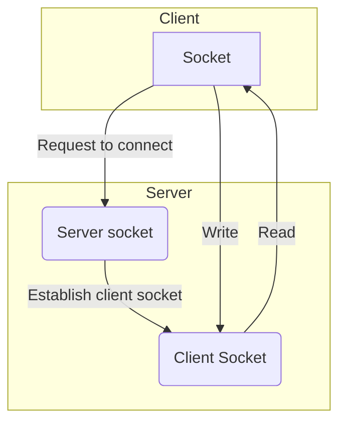
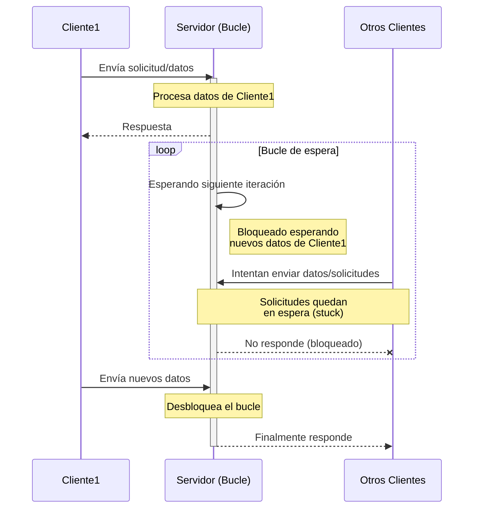

# Sockets Bloqueantes


Crearemos un ejemplo de un socket bloqueante. Un cliente se conecta a nuestro socket de servidor. El servidor crea un nuevo socket para comunicarse con el cliente.




Podemos crear este socket de servidor con el módulo `socket` de Python. Este módulo proporciona funcionalidad para leer, escribir y manipular sockets. Para empezar a crear sockets, crearemos un servidor simple que escucha la conexión de un cliente e imprime un mensaje cuando se establece una conexión exitosa. Este socket estará vinculado a un nombre de host y a un puerto, y será el socket de servidor principal con el que se comunicarán los clientes.

Primero specificamos dos parámetros para la función `socket`. 

- El primero es `socket.AF_INET`, que indica con qué tipo de dirección podrá interactuar nuestro `socket` en este caso un nombre de host y un número de puerto. 
- El segundo es `socket.SOCK_STREAM`, que significa que utilizamos el protocolo TCP para nuestra comunicación.
- Llamamos a setsockopt para establecer el indicador `SO_REUSEADDR` en 1. Esto nos permitirá reutilizar el número de puerto después de detener y reiniciar la aplicación, evitando errores de dirección ya en uso. Si no lo hiciéramos, el sistema operativo podría tardar un tiempo en desvincular este puerto y que nuestra aplicación se inicie sin errores.

```python title="Sockets" linenums="1"
import socket

server_socket = socket.socket(socket.AF_INET, socket.SOCK_STREAM)
server_socket.setsockopt(socket.SOL_SOCKET, socket.SO_REUSEADDR, 1)
```


Llamar a socket.socket nos permite crear un socket, pero aún no podemos empezar a comunicarnos con él porque no lo hemos vinculado a una dirección con la que los clientes puedan comunicarse (¡se necesita una dirección!). 

Para este ejemplo, vincularemos el socket a una dirección en nuestro propio ordenador, 127.0.0.1, y elegiremos un número de puerto arbitrario de 8000:


```python
address = (127.0.0.1, 8000)
server_socket.bind(server_address)
```

ahora en este punto necesitamos estar escuchando activamente para detectar conexiones de nuestros clients, los que tratarán de conectarse a nuestro servidor. Esto lo hacemos usando el metodo `listen`, el cual le dice a nuestro socket que escuche por conexiones entrantes. Entonces esperamos por una conexión llamando al metodo `accept` en el socket. Este metodo bloqueará hasta que obtengamos una conexión. La conexión será otro socket que se usará para leer y escribir data del client.

```python
server_socket.listen()
connection, client_address = server_socket.accept()
```

## Ejemplo completo

```python title="Ejemplo socket" linenums="1"
import socket

server_socket = socket.socket(socket.AF_INET, socket.SOCK_STREAM)
server_socket.setsockopt(socket.SOL_SOCKET, socket.SO_REUSEADDR, 1)

server_address = ('127.0.0.1', 8000)
server_socket.bind(server_address)
server_socket.listen()

connection, client_address = server_socket.accept()
print(f'I got a connection from {client_address}!')
```
Basta con abrir la url en nuestro explorador o usar curl `curl localhost:8000` o usar telnet.

```bash title="Salida corriendo tres veces el ejemplo"
I got a connection from ('127.0.0.1', 56188)!
I got a connection from ('127.0.0.1', 36732)!
I got a connection from ('127.0.0.1', 35544)!
```


## Leer y escribir datos desde y hacia un socket


La clase `socket` tiene un método llamado `recv` que podemos usar para obtener datos de un socket específico. Este método toma un entero que representa la cantidad de bytes que deseamos leer en un momento dado. Esto es importante porque no podemos leer todos los datos de un socket a la vez; necesitamos almacenar en búfer hasta llegar al final de la entrada.

Para este ejemplo, trataremos el final de la entrada como un retorno de carro más un avance de línea o `'\r\n'`. 

Para demostrar cómo funciona el almacenamiento en búfer con mensajes pequeños, estableceremos un tamaño de búfer intencionalmente bajo. En una aplicación real, usaríamos un tamaño de búfer mayor, como 1024 bytes. Normalmente, querríamos un tamaño de búfer mayor, ya que esto aprovechará el almacenamiento en búfer que se produce a nivel del sistema operativo, lo cual es más eficiente que hacerlo en la aplicación.

### Ejemplo para leer desde un socket

```python title="Ejemplo para leer desde un socket" linenums="1"
import socket

server_socket = socket.socket(socket.AF_INET, socket.SOCK_STREAM)
server_socket.setsockopt(socket.SOL_SOCKET, socket.SO_REUSEADDR, 1)

server_address = ('127.0.0.1', 8000)
server_socket.bind(server_address)
server_socket.listen()

try:
    connection, client_address = server_socket.accept()
    print(f"Cliente connectandose desde {client_address}")
    buffer = b''
    while buffer[-2:] != b'\r\n':
        data = connection.recv(2)
        if not data:
            break
        else:
            print(f"Data leida: {data}")
            buffer = buffer + data
    print("Toda la data leida: {buffer}")
finally:
    server_socket.close()
```

1. Esperamos una conexión con `server_socket.accept`. 
2. Una vez que obtenemos una conexión, intentamos recibir dos bytes y los almacenamos en nuestro búfer.
3. Entramos en un bucle, comprobando en cada iteración si nuestro búfer termina con un retorno de carro y un salto de línea. 
    1. Si no es así, obtenemos dos bytes más, imprimimos los bytes recibidos y los añadimos al búfer. 
    2. Si obtenemos `'\r\n'`, finalizamos el bucle e imprimimos el mensaje completo recibido del cliente. 
4. Cerramos el socket del servidor en un bloque `finally`. Esto garantiza el cierre de la conexión incluso si se produce una excepción al leer los datos.

Para testear usaremos `nc`

`echo -e "Hola Mundo\r\n" | nc localhost 8000`

```bash title="Salida"
Cliente connectandose desde ('127.0.0.1', 56860)
Data leida: b'Ho'
Data leida: b'la'
Data leida: b' M'
Data leida: b'un'
Data leida: b'do'
Data leida: b'\r\n'
Toda la data leida: b'Hola Mundo\r\n'
```

### Ejemplo para leer y escribir

Los `sockets` tienen un método llamado `sendall` que tomará un mensaje y lo escribirá de vuelta al cliente para nosotros.

```python title="Ejemplo para leer y escribir desde y hacia un socket" linenums="1"
import socket

server_socket = socket.socket(socket.AF_INET, socket.SOCK_STREAM)
server_socket.setsockopt(socket.SOL_SOCKET, socket.SO_REUSEADDR, 1)

server_address = ('127.0.0.1', 8000)
server_socket.bind(server_address)
server_socket.listen()

try:
    connection, client_address = server_socket.accept()
    print(f"Cliente connectandose desde {client_address}")
    buffer = b''
    while buffer[-2:] != b'\r\n':
        data = connection.recv(2)
        if not data:
            break
        else:
            print(f"Data leida: {data}")
            buffer = buffer + data
    print("Toda la data leida: {buffer}")
    connection.sendall(b'Gracias por su Mensaje\n')
finally:
    server_socket.close()
```

Para testear usaremos `nc`

`echo -e "Hola Mundo\r\n" | nc localhost 8000`

```bash title="Salida"
Cliente connectandose desde ('127.0.0.1', 56860)
Data leida: b'Ho'
Data leida: b'la'
Data leida: b' M'
Data leida: b'un'
Data leida: b'do'
Data leida: b'\r\n'
Toda la data leida: b'Hola Mundo\r\n'
```

```bash title="Salida del lado de cliente"
echo -e "Hola Mundo\r\n" | nc localhost 8000
Gracias por su Mensaje
```

### Ejemplo para leer y escribir desde multiples usuarios

Un `socket` en modo de escucha permite múltiples conexiones de cliente simultáneamente. Esto significa que podemos llamar a `socket.accept` repetidamente, y cada vez que un cliente se conecta, obtendremos un nuevo socket de conexión para leer y escribir datos hacia y desde ese cliente. Con esto podemos adaptar fácilmente nuestro ejemplo anterior para gestionar múltiples clientes. Crearemos un bucle infinito el cual llamara a `socket.accept` para escuchar nuevas conexiones. Cada vez que obtenemos una la añadimos a la lista de conexiones que tenemos hasta el momento. Luego, recorremos cada conexión, recibiendo los datos a medida que llegan y escribiéndolos de vuelta en la conexión del cliente.

```python title="Ejemplo para leer y escribir desde y hacia un socket" linenums="1"
import socket

server_socket = socket.socket(socket.AF_INET, socket.SOCK_STREAM)
server_socket.setsockopt(socket.SOL_SOCKET, socket.SO_REUSEADDR, 1)

server_address = ('127.0.0.1', 8000)
server_socket.bind(server_address)
server_socket.listen()

connections = []

try:
    while True:
        print("Listo para recibir mensajes!")
        connection, client_address = server_socket.accept()
        print(f"Cliente connectandose desde {client_address}")
        connections.append(connection)
        for connection in connections:
            buffer = b''
            while buffer[-2:] != b'\r\n':
                data = connection.recv(2)
                if not data:
                    break
                else:
                    print(f"Data leida: {data}")
                    buffer = buffer + data
            print(f"Toda la data leida: {buffer}")
            connection.send(buffer)
finally:
    server_socket.close()
```

Desde dos ventanas corremos:

- `echo -e "Hola Mundo\r\n" | nc localhost 8000`
- `echo -e "Hola Mundo2\r\n" | nc localhost 8000`

```bash title="Salida"
Listo para recibir mensajes!
Cliente connectandose desde ('127.0.0.1', 40068)
Data leida: b'Ho'
Data leida: b'la'
Data leida: b' M'
Data leida: b'un'
Data leida: b'do'
Data leida: b'\r\n'
Toda la data leida: b'Hola Mundo\r\n'
Listo para recibir mensajes!
Cliente connectandose desde ('127.0.0.1', 54530)
Data leida: b'\n'
```

```bash title="Salida cliente 1"
echo -e "Hola Mundo\r\n" | nc localhost 8000
Hola Mundo

```

```bash title="Salida cliente 2"
echo -e "Hola Mundo2\r\n" | nc localhost 8000

```

Ambos clientes parecen estar conectados aun al socket!

Nuestro primer cliente funcionará correctamente y enviará mensajes de eco como esperábamos, pero nuestro segundo cliente no recibirá ningún mensaje de eco. Esto se debe al comportamiento de bloqueo predeterminado de los sockets. Los métodos `accept` y `recv` se bloquean hasta que reciben datos. Esto significa que una vez que el primer cliente se conecta, nos bloquearemos a la espera de que nos envíe su primer mensaje de eco.
Esto hace que otros clientes se queden atascados esperando la siguiente iteración del bucle, lo que no ocurrirá hasta que el primer cliente envíe datos.




1. Cliente1 inicia la comunicación enviando datos al servidor
2. El servidor entra en un bucle esperando la siguiente iteración
3. Otros clientes intentan comunicarse pero quedan atascados
4. El servidor está bloqueado esperando exclusivamente a Cliente1
5. Solo cuando Cliente1 envía nuevos datos, el bucle continúa y los otros clientes pueden ser atendidos