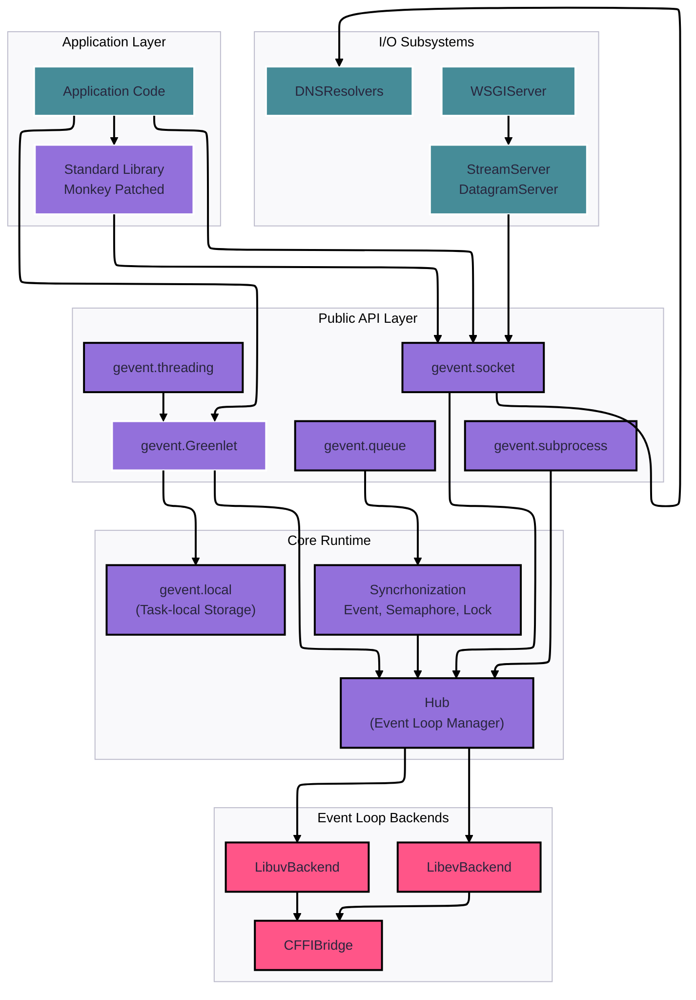
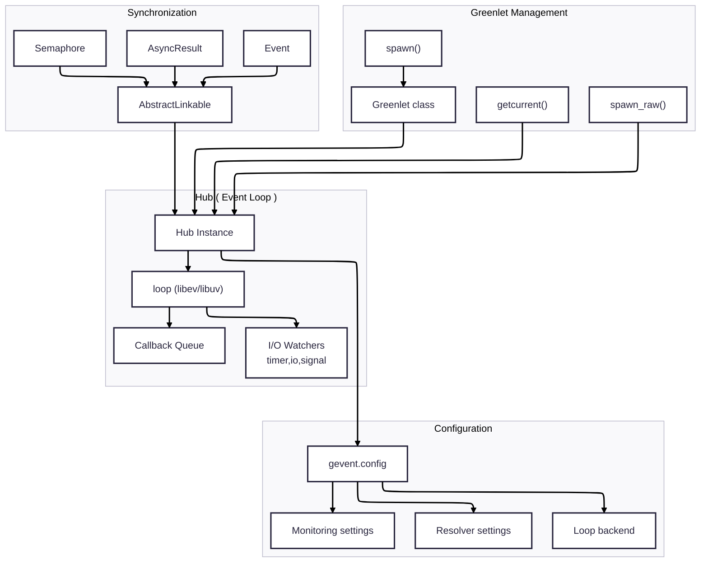

# Gevent + Asyncio

Para poder empezar a trabajar asyncio con proyectos desarollados originalmente con gevent, tenemos librerias como gevent_asyncio que crea puentes entre ambos frameworks.

## Gevent a fondo

Gevent ofrece una biblioteca de redes de Python basada en corrutinas que utiliza multitarea cooperativa para proporcionar una API síncrona sobre E/S asíncrona.

gevent permite escribir aplicaciones de red asíncronas utilizando patrones de programación síncrona conocidos. Esto se logra mediante tres mecanismos principales:

- Multitarea cooperativa mediante greenlets (hilos ligeros y cooperativos)
- E/S basada en eventos mediante backends libev o libuv
- Aplicación de parches para que los módulos de la biblioteca estándar sean compatibles con gevent

Esta biblioteca permite a los desarrolladores escribir código que parece síncrono pero se ejecuta de forma asíncrona, cediendo automáticamente el control durante las operaciones de E/S sin necesidad de devoluciones de llamadas explícitas ni sintaxis async/await.

### Descripción general de la arquitectura del sistema

`gevent` sigue una arquitectura en capas donde las aplicaciones interactúan con módulos de biblioteca estándar parcheados por Monkey o con la API directa de gevent, los cuales se coordinan a través de un bucle de eventos central y un sistema de gestión de greenlets.

#### Descripción general de la arquitectura de alto nivel

Este diagrama muestra cómo interactúan los componentes principales de gevent. El Hub actúa como coordinador central, gestionando el bucle de eventos y programando los greenlets. Las aplicaciones pueden usar la API directa de gevent o módulos de la biblioteca estándar con parches de Monkey.

#### Componentes principales del entorno de ejecución (Core Runtime)

El entorno de ejecución se centra en tres abstracciones principales que trabajan juntas para proporcionar multitarea cooperativa:

#### Relaciones de los componentes principales en tiempo de ejecución

Este diagrama ilustra cómo se coordinan los greenlets, el concentrador y las primitivas de sincronización. Todos los objetos de sincronización implementan el protocolo AbstractLinkable para integrarse con el bucle de eventos.

#### Subsistemas Clave

|Subsystem|Primary Classes|Purpose|
| --- | --- | --- |
| Event Loop | Hub, loop classes | Coordinación Central  y  I/O Multiplexado | 
| Greenlets | Greenlet, spawn_raw | Manejo de tareas cooperativas |
| Networking | socket, DNS resolvers | Non-blocking network I/O |
| Servers | StreamServer, WSGIServer | High-level server abstraction |s
| Monkey Patching | gevent.monkey package | Standard library compatibility |
| Configuration | Config, setting classes | Runtime behavior control |

#### Integración de bucles de eventos

`gevent` admite múltiples backends de bucles de eventos mediante una arquitectura de plugins:

- `libev` (extensión de C): Alto rendimiento, predeterminado en sistemas POSIX
- `libev` (CFFI): Alternativa a Python puro mediante enlaces CFFI
- `libuv` (CFFI): Multiplataforma, predeterminado en Windows

La selección del backend se configura mediante `gevent.config.loop` y puede recurrir automáticamente según la disponibilidad.

## Cómo funciona el bucle de eventos de Gevent

El bucle de eventos de Gevent es un sofisticado sistema de E/S asíncrono basado en dos backends alternativos de bibliotecas de C: libev (predeterminado en Unix) y libuv (predeterminado en Windows). El bucle de eventos opera mediante una arquitectura basada en un concentrador que coordina la programación de greenlets y las operaciones de E/S.

### Arquitectura principal

El bucle de eventos sigue una interfaz bien definida que abstrae las implementaciones subyacentes de la biblioteca de C. 

La interfaz define métodos esenciales, como `run()`, `now()` y varios métodos de creación de observadores como `io()`, `timer()` y `signal()`, que permiten monitorizar diferentes tipos de eventos. 

### El concentrador: Coordinador central

El concentrador actúa como coordinador central que gestiona el bucle de eventos y funciona como un greenlet especial que lo ejecuta. El método `run()` del Hub es el punto de entrada principal que opera continuamente el bucle de eventos. 

El Hub se ejecuta en un bucle infinito, invocando `loop.run()` en la implementación del bucle de eventos subyacente y gestionando cualquier salida del bucle lanzando una excepción `LoopExit` al greenlet padre. 

### Implementaciones de bucles de eventos

#### Backend de libev
El backend de libev proporciona una implementación basada en Cython que invoca directamente la función `ev_run()` de libev con indicadores adecuados para diferentes modos de ejecución (nowait, once). 

#### Backend de libuv
El backend de libuv implementa un bucle de ejecución más complejo que gestiona la ejecución de las devoluciones de llamada de forma diferente. Se ejecuta en un bucle while en el modo predeterminado, gestionando las devoluciones de llamada y utilizando `uv_run()` con diferentes modos según las devoluciones de llamada pendientes.

### Sistema de Gestión de Devoluciones de Llamadas

El bucle de eventos gestiona las devoluciones de llamadas mediante un sistema basado en colas. Cuando el código necesita programar la ejecución de una función, utiliza `run_callback()`, que añade la devolucion de llamada a una cola. 

El método `_run_callbacks()` procesa las devoluciones de llamada en cola durante cada iteración del bucle, respetando los intervalos de conmutación para evitar que la ejecución de las devoluciones de llamada monopolice el bucle de eventos. 

La ejecución de las devoluciones de llamada incluye una gestión integral de errores, lo que garantiza que las excepciones en una devolucion de llamada no bloqueen todo el bucle de eventos. 

### Sistema de Vigilantes

Los vigilantes son objetos que monitorizan eventos específicos (E/S, temporizadores, señales, etc.) y ejecutan devoluciones de llamada cuando ocurren. La interfaz del vigilante define los métodos `start()`, `stop()` y `close()` para la gestión del ciclo de vida. 

### Flujo del bucle de eventos

El flujo típico del bucle de eventos de gevent es:

1. **Inicializar**: El Hub crea el backend del bucle de eventos adecuado.
2. **Ejecutar bucle**: El Hub llama a `loop.run()` en un bucle infinito.
3. **Procesar eventos**: El backend consulta eventos de E/S, temporizadores y señales.
4. **Ejecutar devoluciones de llamada**: Las devoluciones de llamada en cola se ejecutan mediante `_run_callbacks()`.
5. **Programar Greenlets**: Las devoluciones de llamada suelen cambiar a greenlets en espera.
6. **Repetir**: El bucle continúa hasta que no queden más eventos ni greenlets.

### Seguridad de subprocesos

Para una programación de devoluciones de llamada segura para subprocesos, gevent proporciona `run_callback_threadsafe()`, que programa una devolucion de llamada y le indica al bucle de eventos que se active. 

El diseño del bucle de eventos de Gevent proporciona una abstracción de alto nivel sobre las bibliotecas de eventos de C de bajo nivel, manteniendo un rendimiento excelente. La arquitectura basada en Hub permite una integración fluida con el modelo de subprocesos de Python, y el sistema de devolución de llamadas garantiza una programación eficiente de operaciones asíncronas. El enfoque dual de backend (libev/libuv) proporciona optimizaciones específicas para cada plataforma, manteniendo una API consistente.

