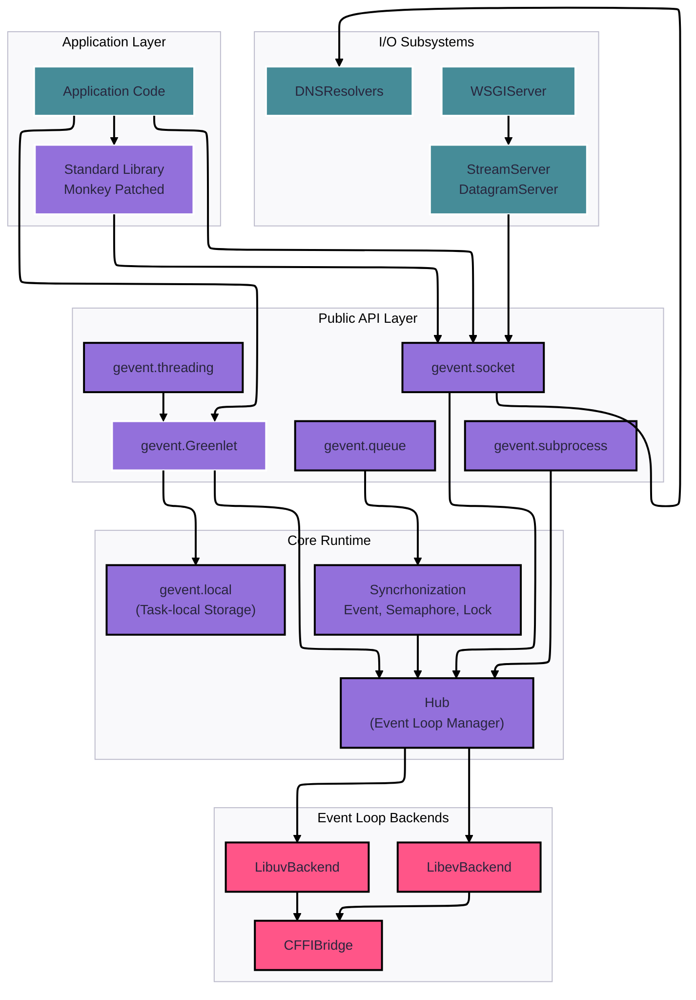

# Gevent + Asyncio

Para poder empezar a trabajar asyncio con proyectos desarollados originalmente con gevent, tenemos librerias como gevent_asyncio que crea puentes entre ambos frameworks.

## Gevent a fondo

Gevent ofrece una biblioteca de redes de Python basada en corrutinas que utiliza multitarea cooperativa para proporcionar una API síncrona sobre E/S asíncrona.

gevent permite escribir aplicaciones de red asíncronas utilizando patrones de programación síncrona conocidos. Esto se logra mediante tres mecanismos principales:

- Multitarea cooperativa mediante greenlets (hilos ligeros y cooperativos)
- E/S basada en eventos mediante backends libev o libuv
- Aplicación de parches para que los módulos de la biblioteca estándar sean compatibles con gevent

Esta biblioteca permite a los desarrolladores escribir código que parece síncrono pero se ejecuta de forma asíncrona, cediendo automáticamente el control durante las operaciones de E/S sin necesidad de devoluciones de llamadas explícitas ni sintaxis async/await.

### Descripción general de la arquitectura del sistema

`gevent` sigue una arquitectura en capas donde las aplicaciones interactúan con módulos de biblioteca estándar parcheados por Monkey o con la API directa de gevent, los cuales se coordinan a través de un bucle de eventos central y un sistema de gestión de greenlets.

